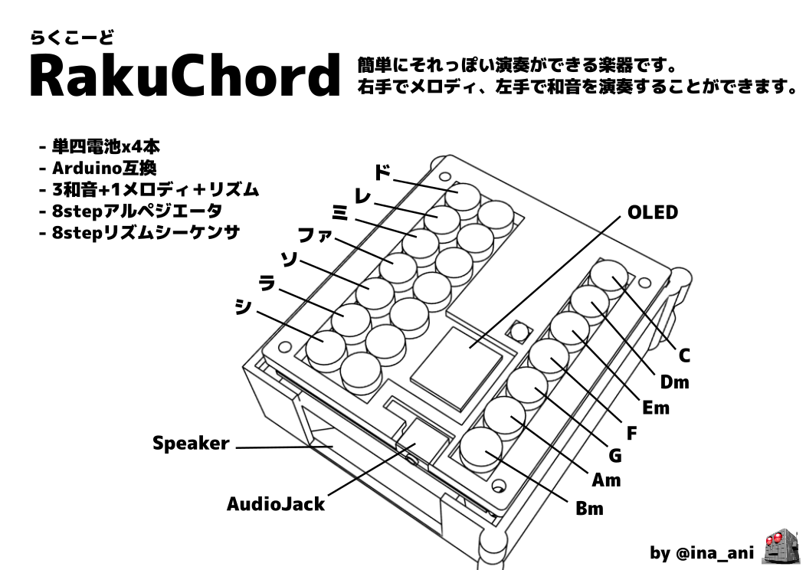

# RakuChord - らくこーど

楽にそれっぽい演奏ができる楽器です。

紹介ページ: https://inajob.github.io/rakuchord/



# ディレクトリ構成

- docs
  - github pages用ページ
- firmware
  - 本体firmware
- model
  - 筐体データ
- circuit
  - 回路図

# ファームウェアの更新

ビルドには[Platformio](https://platformio.org/)を利用しています。
このリポジトリをCloneしたのちに書きコマンドでファームウェアを更新できます。

```
$ cd firmware
$ platformio run
```

